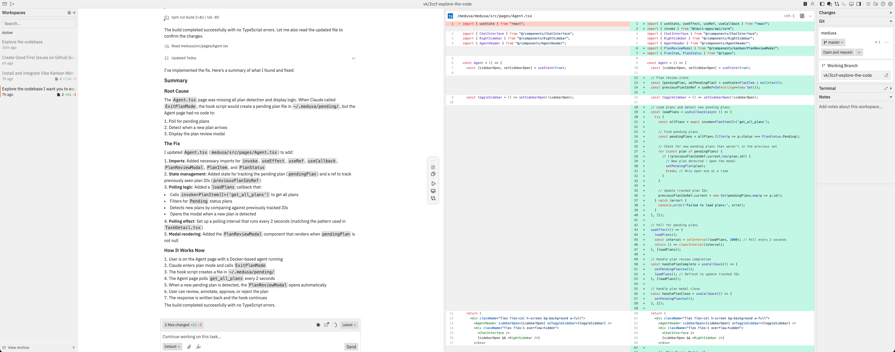

# Task AI Platform

Task AI Platform is a local desktop record manager for handing one project
between Claude, Codex, and other coding-agent sessions. The agents keep working
in their normal CLI or desktop environment; this app connects a local project
root and an optional SSH project root into one logical **AI Room**.

Each room permanently installs the `.ai-room` protocol on the local root. For a
server session, the app temporarily prepares the same protocol and managed
`AGENTS.md`/`CLAUDE.md` blocks on the SSH root. A conflict-free sync copies new
session records to the local root and removes the temporary server records. The
app manages those records rather than proxying an AI chat.

> This repository is derived from Vibe Kanban v0.1.36 under the Apache License
> 2.0. The original copyright and licence are preserved in `LICENSE`.

## Current implementation

- One project = one AI Room
- Local root plus optional SSH alias and remote root mapping
- Automatic `.ai-room/ROOM.md`, context, decision, task, and session structure
- Non-destructive managed blocks in existing `AGENTS.md` and `CLAUDE.md`
- Server sessions use an explicit prepare step followed by automatic synchronization and clean-up
- Local-only final retention after a conflict-free server synchronization
- Conflict preservation: differing records are never overwritten or deleted
- Local Qwen summarizer adds one validated, append-only task-status line per completed AI session
- Completion markers prevent automatic cleanup while an AI session is still active
- Shared context, decisions, tasks, and session history viewer/editor
- Existing Vibe Kanban foundations retained as a compatibility layer

## Overview

In a world where software engineers spend most of their time planning and reviewing coding agents, the most impactful way to ship more is to get faster at planning and review.

Use Kanban issues to plan work, either privately or with your team. When you are ready to begin, create workspaces where coding agents can execute.

- **Plan with kanban issues** — create, prioritise, and assign issues on a kanban board
- **Run coding agents in workspaces** — each workspace gives an agent a branch, a terminal, and a dev server
- **Review diffs and leave inline comments** — send feedback directly to the agent without leaving the UI
- **Preview your app** — built-in browser with devtools, inspect mode, and device emulation
- **Switch between 10+ coding agents** — Claude Code, Codex, Gemini CLI, GitHub Copilot, Amp, Cursor, OpenCode, Droid, CCR, and Qwen Code
- **Create pull requests and merge** — open PRs with AI-generated descriptions, review on GitHub, and merge



One command. Describe the work, review the diff, ship it.

```bash
npx vibe-kanban
```

## Installation

Make sure you have authenticated with your favourite coding agent. A full list of supported coding agents can be found in the [docs](https://vibekanban.com/docs/supported-coding-agents). Then in your terminal run:

```bash
npx vibe-kanban
```

## Documentation

Head to the [website](https://vibekanban.com/docs) for the latest documentation and user guides.

## AI Rooms and SSH servers

Create a room from the desktop app:

1. Choose the local project root.
2. Optionally select a `Host` alias already registered in `~/.ssh/config` and
   choose or enter the matching server project root.
3. Create the room; its permanent instructions are installed only on the local root.
4. Before server work, click **Prepare server work** in the room.
5. Run Claude or Codex normally from the server project root.
6. Leave the local app running. It detects completed server session records,
   copies them locally, and removes the temporary server room automatically.
   **Synchronize now** remains available as a recovery action.

The app summarizes completed session files through a local Ollama service and
never sends their contents to a cloud model. On each Windows computer, install
Ollama and the default model once:

```powershell
winget install --id Ollama.Ollama -e
ollama pull qwen3.5:4b
```

The summarizer checks completed sessions in the background, validates the
model's structured result, and appends one line to `tasks.md`. Processed session
hashes are stored locally in `.ai-room/task-summary-state.json` to prevent
duplicates. If Ollama is temporarily unavailable, the session remains pending
and is retried automatically; synchronization and normal room use continue.

If a conflict is detected, the app deliberately leaves the server copy in place
so no record is lost. Resolve the conflict and synchronize again to finish the
clean-up.

Private key contents are never read by the web UI. The backend passes only the
selected alias to the system OpenSSH client and suppresses `SetEnv`/`SendEnv`
entries so unrelated local secrets are not forwarded. Shared room records must
never contain tokens, private keys, or credentials.

## Self-Hosting

Want to host your own Vibe Kanban Cloud instance? See our [self-hosting guide](https://vibekanban.com/docs/self-hosting/deploy-docker).

## Support

We use [GitHub Discussions](https://github.com/BloopAI/vibe-kanban/discussions) for feature requests. Please open a discussion to create a feature request. For bugs please open an issue on this repo.

## Contributing

We would prefer that ideas and changes are first raised with the core team via [GitHub Discussions](https://github.com/BloopAI/vibe-kanban/discussions) or [Discord](https://discord.gg/AC4nwVtJM3), where we can discuss implementation details and alignment with the existing roadmap. Please do not open PRs without first discussing your proposal with the team.

## Development

### Prerequisites

- [Rust](https://rustup.rs/) (latest stable)
- [Node.js](https://nodejs.org/) (>=20)
- [pnpm](https://pnpm.io/) (>=8)

Additional development tools:

```bash
cargo install cargo-watch
cargo install sqlx-cli
```

Install dependencies:

```bash
pnpm i
```

### Running the dev server

```bash
pnpm run dev
```

This will start the backend and web app. A blank DB will be copied from the `dev_assets_seed` folder.

### Building the web app

To build just the web app:

```bash
cd packages/local-web
pnpm run build
```

### Build from source (macOS)

1. Run `./local-build.sh`
2. Test with `cd npx-cli && node bin/cli.js`

### Environment Variables

The following environment variables can be configured at build time or runtime:

| Variable                   | Type       | Default                 | Description                                                                                                                |
| -------------------------- | ---------- | ----------------------- | -------------------------------------------------------------------------------------------------------------------------- |
| `POSTHOG_API_KEY`          | Build-time | Empty                   | PostHog analytics API key (disables analytics if empty)                                                                    |
| `POSTHOG_API_ENDPOINT`     | Build-time | Empty                   | PostHog analytics endpoint (disables analytics if empty)                                                                   |
| `PORT`                     | Runtime    | Auto-assign             | **Production**: Server port. **Dev**: Frontend port (backend uses PORT+1)                                                  |
| `BACKEND_PORT`             | Runtime    | `0` (auto-assign)       | Backend server port (dev mode only, overrides PORT+1)                                                                      |
| `FRONTEND_PORT`            | Runtime    | `3000`                  | Frontend dev server port (dev mode only, overrides PORT)                                                                   |
| `HOST`                     | Runtime    | `127.0.0.1`             | Backend server host                                                                                                        |
| `MCP_HOST`                 | Runtime    | Value of `HOST`         | MCP server connection host (use `127.0.0.1` when `HOST=0.0.0.0` on Windows)                                                |
| `MCP_PORT`                 | Runtime    | Value of `BACKEND_PORT` | MCP server connection port                                                                                                 |
| `DISABLE_WORKTREE_CLEANUP` | Runtime    | Not set                 | Disable all git worktree cleanup including orphan and expired workspace cleanup (for debugging)                            |
| `VK_ALLOWED_ORIGINS`       | Runtime    | Not set                 | Comma-separated list of origins that are allowed to make backend API requests (e.g., `https://my-vibekanban-frontend.com`) |
| `VK_SHARED_API_BASE`       | Runtime    | Not set                 | Base URL for the remote/cloud API used by the local desktop app                                                            |
| `VK_SHARED_RELAY_API_BASE` | Runtime    | Not set                 | Base URL for the relay API used by tunnel-mode connections                                                                 |
| `VK_TUNNEL`                | Runtime    | Not set                 | Enable relay tunnel mode when set (requires relay API base URL)                                                            |

**Build-time variables** must be set when running `pnpm run build`. **Runtime variables** are read when the application starts.

#### Self-Hosting with a Reverse Proxy or Custom Domain

When running Vibe Kanban behind a reverse proxy (e.g., nginx, Caddy, Traefik) or on a custom domain, you must set the `VK_ALLOWED_ORIGINS` environment variable. Without this, the browser's Origin header won't match the backend's expected host, and API requests will be rejected with a 403 Forbidden error.

Set it to the full origin URL(s) where your frontend is accessible:

```bash
# Single origin
VK_ALLOWED_ORIGINS=https://vk.example.com

# Multiple origins (comma-separated)
VK_ALLOWED_ORIGINS=https://vk.example.com,https://vk-staging.example.com
```

### Remote Deployment

When running Vibe Kanban on a remote server (e.g., via systemctl, Docker, or cloud hosting), you can configure your editor to open projects via SSH:

1. **Access via tunnel**: Use Cloudflare Tunnel, ngrok, or similar to expose the web UI
2. **Configure remote SSH** in Settings → Editor Integration:
   - Set **Remote SSH Host** to your server hostname or IP
   - Set **Remote SSH User** to your SSH username (optional)
3. **Prerequisites**:
   - SSH access from your local machine to the remote server
   - SSH keys configured (passwordless authentication)
   - VSCode Remote-SSH extension

When configured, the "Open in VSCode" buttons will generate URLs like `vscode://vscode-remote/ssh-remote+user@host/path` that open your local editor and connect to the remote server.

See the [documentation](https://vibekanban.com/docs/settings/general) for detailed setup instructions.
